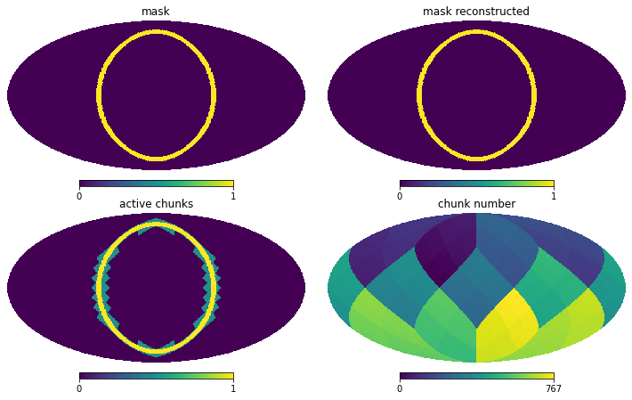

# chunkpix
*Albert Izard, 2022*

`chunkpix` efficiently stores [Healpix](https://healpix.jpl.nasa.gov/) maps that are sparse (contain many zeros). It uses a lower resolution healpix map that stores which of these large pixels, or chunks, are active. Only pixels belonging to active chunks need to be stored, with all the other ones assumed to be 0.

Therefore, a chunkpix map consists of chunks of the original map and a list of active chunks. This information is enough to reconstruct the full original map with no loss of information.

Each instance of this class can store one chunkpix map.

Parameters:
- nside: resolution of the map
- nside_chunks: resolution of the low-res chunk map.
We suggest a default value of 8, corresponding to 768 chunks. But depending on your problem and requirements try different numbers and check the memory reduction of your maps with the method chunk_sparsity. When the domain is more compact or circular, a lower value may be desirable.
- Data_type_cmap: data type we want to use for the map.

The data type to store chunk numbers in active_chunks is np.uint16. This can hold integers up to 2**16-1=65535, which would suffice for up to nside_chunks = 64.

Usage:
1. Initialize class with nside, nside_chunks
2.
  * Add counts one-by-one with increase_ipix_count
  * Or convert a full map to a chunk map with full_map2chunk_map
3. Retrieve full map with reconstruct_full_map

## Examples

#### Demonstrate the basics of chunkpix
Add some counts to an empty map and see how data is stored.

```python
from chunkpix import *

cmap = Chunkpix(16,4)
cmap.increase_ipix_count(33)
cmap.increase_ipix_count(0)
cmap.increase_ipix_count(0)
cmap.increase_ipix_count(1)
cmap.print_params()

map_reconstructed = cmap.reconstruct_full_map()
map_reconstructed
```
>Map intialized to 0. Data type: float32 \
nside: 16 \
nside_chunks: 4 \
data_type_cmap: <class 'numpy.float32'> \
data_type_chunks: <class 'numpy.uint16'> \
npix: 3072 \
nchunks: 192 \
npix_per_chunk: 16 \
n_active_chunks: 2 \
active_chunks: [2 0] \
cmap: [0. 1. 0. 0. 0. 0. 0. 0. 0. 0. 0. 0. 0. 0. 0. 0. 2. 1. 0. 0. 0. 0. 0. 0. 0. 0. 0. 0. 0. 0. 0. 0.] \
\
array([2., 1., 0., ..., 0., 0., 0.], dtype=float32)


#### Store and reconstruct a mask

Create a map representing a mask. Store this map as a chunkpix and reconstruct it back to full size.

For example, we first define a function to create a mask for a given range of values in the x-axis.
```python
import healpy as hp
import numpy as np
import matplotlib.pylab as plt

def create_mask_xrange(nside, xrange=(0,0.1), is_nested=True):
    """
    Return a mask that has ones in the specified xrange (in radius units)
    """
    (xmin, xmax) = xrange
    npix = hp.nside2npix(nside)
    m = np.arange(npix)
    m_vec = hp.pix2vec(nside, m, nest=is_nested)
    return (xmin<m_vec[0])&(m_vec[0]<xmax)
```

Create a mask and convert it to chunkpix.

```python
nside = 64
nside_chunks = 8

cmap = Chunkpix(nside,nside_chunks)

mask = create_mask_xrange(nside, (0.3,0.4), is_nested=True).astype(cmap.data_type_cmap)
cmap.full_map2chunk_map(mask)
mask_reconstructed = cmap.reconstruct_full_map()

map_active_chunks = cmap.create_map_active_chunks()
map_chunks = cmap.create_map_chunk_numbers()
```
```python
print('fsky_mask:', sum(mask)/mask.size)
print('fsky_patch:', cmap.chunk_sparsity())
print('Patch/Mask:', sum(map_active_chunks)/sum(mask))
print(f'# active patches: {cmap.n_active_chunks}/{cmap.nchunks}')
print(f"full map: {mask.nbytes/1024} Kb")
print(f"chunkpix: {cmap.cmap.nbytes/1024} Kb")
```
> fsky_mask: 0.0494384765625 \
fsky_patch: 0.10416666666666667 \
Patch/Mask: 2.1069958847736627 \
\# active patches: 80/768 \
full map: 192.0 Kb \
chunkpix: 20.0 Kb


```python
fig = plt.figure(figsize=(10, 6))
hp.mollview(mask, nest=True, sub=221, title='mask')
hp.mollview(mask_reconstructed, nest=True, sub=222, title='mask reconstructed')
hp.mollview(0.5*map_active_chunks+0.5*mask, nest=True, sub=223, title='active chunks')
hp.mollview(map_chunks, nest=True, sub=224, title='chunk number')
```
> 
